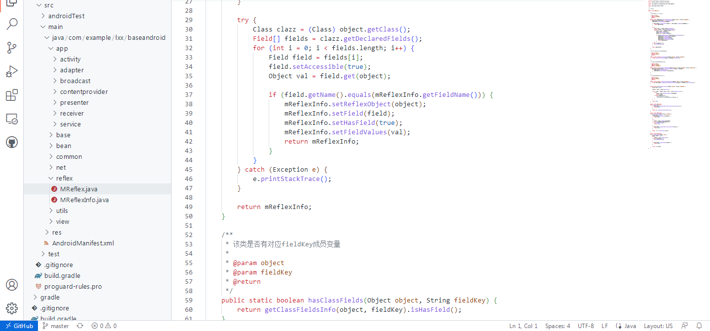

##### 一个较好用的可视化工具: SourceTree

##### github快捷使用方法：
* 在github项目详情，按下`。`快捷键，出现代码网页版代码编辑器(界面如下)，无论是阅读还是抄代码都方便许多；
  
* 按下`t`快捷键，快速搜索代码；

更多快捷键看这里:<https://docs.github.com/cn/get-started/using-github/keyboard-shortcuts>